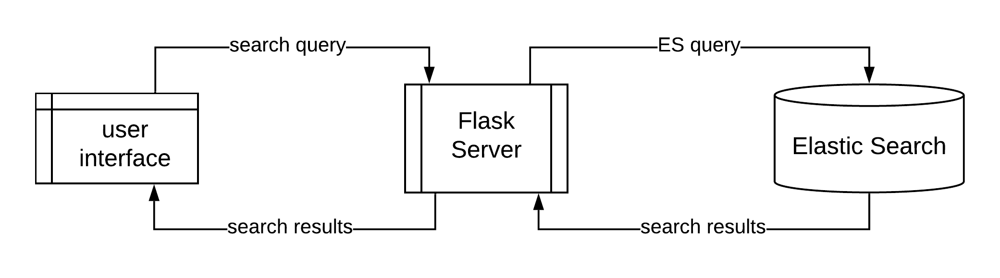
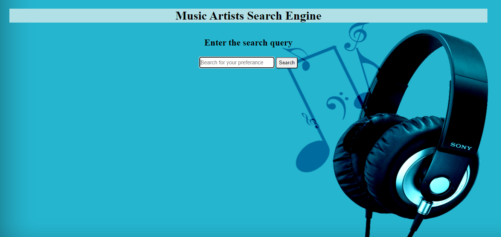

# Music_Artists_Search_Engine

This repository contains source for a search engine that can used to query Music Artists. This information retrieval system was build using Elasticsearch and Python. Flask python framework used for this system. This search engine supports both Sinhala and English language queries. The information about music artists were extract from [pinterest.com] (https://www.pinterest.com/musiclk) and Wikipedia.

## Getting Start

### Setting up the Environment
* Download and Install the _ElasticSearch_
* Install the _ICU_Tokenizer_ plugin on the ElasticSearch
* Install the _python3_ with _pip3_
* Install the python packages in the _requirements.txt_

### Running the Project
1. First start the ElasticSearch locally on port 9200.
2. Then run **_index_creation.py_** file to create the index and insert data.
3. Next run the **_main.py_** to start the search engine
4. Then visit http://localhost:5000/ for see the user interface.
5. Finally add your search query in the search box for searching.

## Directory Structure

 ```
* data - Folder contains data set as csv file and json file and python code used for preprocessing the data set.

* documents - Folder contains project proposal & project report

* images - Folder contains diagrams used in README.md

* templates - Folder contains Html user interface of the search engine

* index_creation.py - Python code for index creating and data inserting

* search_function.py - Python code use for process search query

* advanced_queries.py - Elastic Search queries

* requirements.txt – required packages
 ```
 
## Data Fields

Each artist entry contains the following data fields. Description of the artist and awards details are long text fields.

 ```
1. Artist name
2. Gender
3. Birthday
4. Country
5. Songs
6. Genres of music
7. Awards
8. Description of the artist
9. Votes
 ```
 
## Search Engine

### Indexing
'ICU_Tokenizer’ which is a standard tokenizer and which has better support for Asian languages to tokenize text into the words. It can easily be installed in ElasticSearch and for the index.

### Querying
Cross fields and Phrase prefix are the two types of multi-match queries used. If the query is given specifying one field by using synonyms, then the search will do in phrase_prefix type. After removing synonyms, the whole query will be searched in the given field. If the query is given specifying more than one field or not specifying a field, then the search will do in cross_fields type. After removing synonyms, each word in the query will be searched in the given fields or every field. Aggregation was integrated with queries to get aggregated data with the search result.

## Advance Features

-  Search Engine can identify ranges given in the search query and sort by number of votes. (Range Queries)
    -  හොඳම ගායකයන් 10

- The search engine also supports synonyms and that can be either in Sinhala or in English.
    -  'හොඳම','ජනප්‍රිය','ප්‍රචලිත','ප්‍රසිද්ධ','හොදම','ජනප්‍රියම'
    -  'best','famous','top','most famous','toopest'

-  Search Engine supports both Sinhala and English Language queries (Bilingual Support)
    - ගුණදාස කපුගේ
    - Gunadhasa Kapuge

## Project Architecture

Following figure shows how the search engine works through the flask server.

<br/><br/>

<br/><br/>
 
## User Interface
<br/><br/>

<br/><br/>

